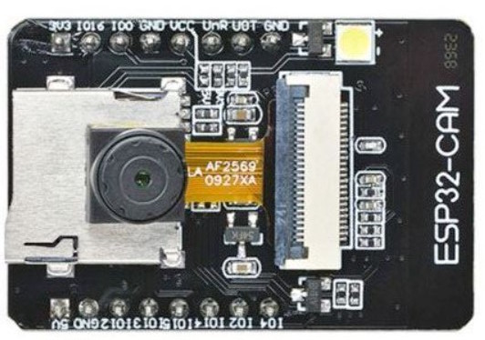
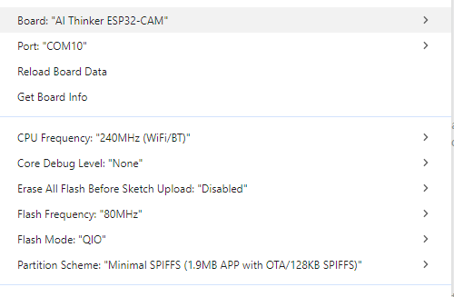
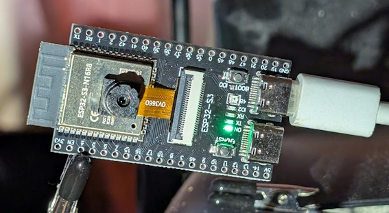
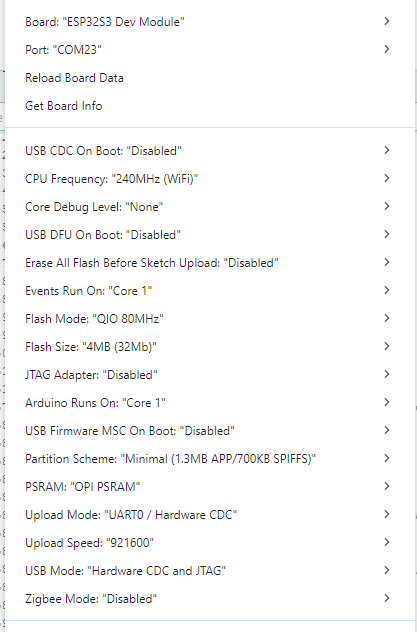
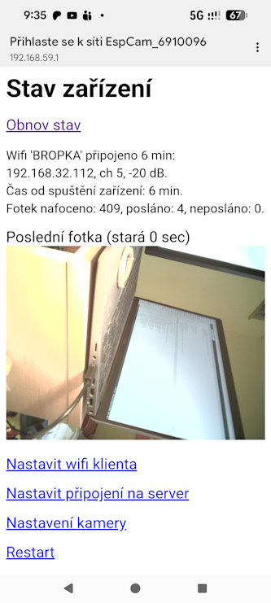
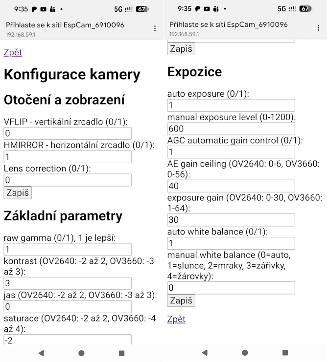

# Esp32Cam-Simple

Jednoduchá aplikace pro obsluhu kamery v ESP32. 
Má následující funkce:
* přes wifi odesílá periodicky fotky do galerie na https://ratatoskr.lovecka.info/
* lokálně nabízí Wifi AP, na které se můžete připojit a přes webový prohlížeč
  * koukat na aktuální fotku z kamery
  * nastavovat parametry kamery
  * nastavit Wifi připojení (SSID, heslo)
  * nastavit parametry připojení na galerii (token)

## Sestavení aplikace

Aplikace je určená pro Arduino IDE. Je potřeba mít nainstalovanou desku ESP32 ve verzi 3.3.x (nyní 3.3.5).

Pro sestavení potřebujete následující knihovny:
* Async TCP (by ESP32Async) 3.4.10
* ESP Async WebServer (by ESP32Async) 3.9.6
* Tasker (by Petr Stehlík) 2.0.3

Před sestavením musíte aplikaci nakonfigurovat podle své desky a kamery.

## Konfigurace aplikace

### 1) Konfigurace desky

1.A) Pokud máte desku ESP32-CAM, tj. tuhle:



tak v souboru [board_config.h](board_config.h) odkomentujte řádek

```
#define CAMERA_MODEL_AI_THINKER // Has PSRAM
```

a zakomentujte ostatní varianty. V Arduino IDE zvolte typ desky "AI Thinker ESP32-CAM" a udělejte tato nastavení:




1.B Pokud máte desku ESP32S3-CAM, tj. tuhle:



tak v souboru [board_config.h](board_config.h) odkomentujte řádek

```
#define CAMERA_MODEL_ESP32S3_EYE // Has PSRAM
```

a zakomentujte ostatní varianty. Pozor, nesplést s ..._ESP_EYE!
Pro připojení k počítači použijte pravý z USB konektorů (tak, jak je na fotce). 
V Arduino IDE zvolte desku "ESP32S3 Dev Module" a udělejte tato nastavení:



### 2) Nastavení kamery

Na začátku souboru [Esp32Cam-Simple.ino](Esp32Cam-Simple.ino) zvolte kameru, jakou máte.
Nejčastější verze je OV2640. Typ kamery je většinou napsán na plochém kabelu ke kameře (viz fotky výše).

```
#define TYP_KAMERY CAMERA_OV2640
// #define TYP_KAMERY CAMERA_OV3660
```

### 3) Nastavení Wifi připojení

V souboru [defaultcfg.h](defaultcfg.h) je konfigurace Wifi klienta (jméno sítě, heslo) a konfigurace galerie, do které se mají fotky nahrávat.
Token, který je tam vložen, je platný.

Všechny tyto konfigurační hodnoty můžete následně změnit připojením k wifi vašeho ESP.

### 4) Nastavení Wifi AP

V souboru [webserver-config.h](webserver-config.h) je konfigurace Wifi AP a webového serveru.


## Přístup přes lokální AP

Na svém telefonu si **vypněte** mobilní data (alespoň to doporučuju - leckteré telefony ochotně přehazují provoz na mobilní data, pokud se jim wifi nelíbí).

Připojte se na AP pojmenované "EspCam_123456" (kde číslo se liší podle ID vašeho čipu). Heslo je "password" (obojí můžete změnit v [webserver-config.h](webserver-config.h) ).

Pokud se telefon zeptá ve stylu "Tato síť není připojená do internetu, co mám dělat?", zvolte "Zachovat připojení".

A pak už by se telefon měl ozvat, že "Tato síť vyžaduje vaše přihlášení" a automaticky vás přehodit na webovou stránku ESP kamery. Pokud to neudělá, spusťte webový prohlížeč a v něm otevřte adresu **http://192.168.59.1**

Objeví se stránka s informací o stavu zařízení a s aktuální fotkou:



Dole máte odkazy na jednotlivé nastavovací stránky. Můžete nastavit připojení k Wifi, připojení k serveru a pak taky vlastnosti kamery.



## Nahrávání obrázků do galerie

Po 30 sekundách od startu (firstShotMs) a pak každé dvě minuty (cameraSendPictureEveryMs) se odešle aktuální fotka do galerie s použitím tokenu z [defaultcfg.h](defaultcfg.h) nebo zadaného přes wifi.
Pokud necháte API token, co je v souboru nyní, fotka bude vidět v této galerii:
https://ratatoskr.lovecka.info/app/gallery/main/4/VerejnyTest

Výběr fotek označených hvězdičkou bude zde:
https://ratatoskr.lovecka.info/app/gallery/stars/4/VerejnyTestVyber

